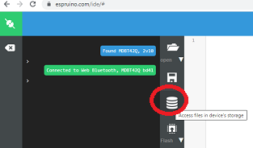
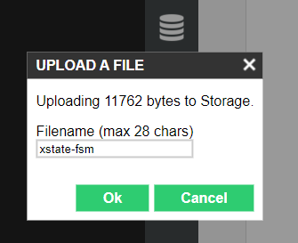
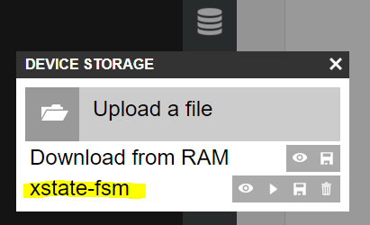
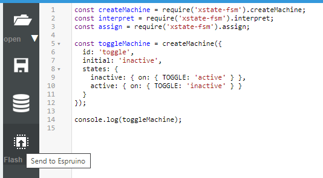

# xstate-fsm-Espruino

This repro contains a modified fork of the finite state machine (FSM), XState/fsm, with modifications necessary to run it as a module within the [Espruino JavaScript Interpreter for Microcontrollers](https://www.espruino.com/).  
Xstate/fsm is a minimal implementation of the Xstate finite state machine , 
designed to run on resource limited devices (eg microcontrollers).  
Note: Xstate/fsm is a package created in earlier versions of Xstate and maintained up to Xstate V4 (still an available branch*).  
and was dropped from the main branch of Xstate in Xstate V5.  

Xstate/fsm enables event-driven programming uisng  state machines which are configured with a javascript object model. V5 versions of Xstate have built up a complex actor model foundation (which is not implemented here).  All versions of Xstate are based upon 'statecharts' enabling nested state models to be defined.  This version of xstate/fsm does not implemented amnested version of statecharts but does enable single level charts to be implemented using a subset of the current Xstate functionality.  
Below is an amended copy of the features table from Xstate/fsm that indicates what features are supported in this Espruino version.

|                             | [@XState/fsm](https://github.com/statelyai/xstate/blob/v4/docs/packages/xstate-fsm/index.md)| | |
| --------------------------- | :-------------: | :----------------:  |:---------------------------------------------: |
| Finite states               |       ✅        |      
| Initial state               |       ✅        |    
| Transitions (object)        |       ✅        | 
| Transitions (string target) |       ✅        | 
| Delayed transitions         |       ❌        |  
| Eventless transitions       |       ❌        |     
| Nested states               |       ❌        |     
| Parallel states             |       ❌        |
| History states              |       ❌        | 
| Final states                |       ❌        |  
| Context                     |       ✅        |  
| Entry actions               |       ✅        |     
| Exit actions                |       ✅        |     
| Transition actions          |       ✅        |   
| Parameterized actions       |       ❌        |   
| Transition guards           |       ✅        |      
| Parameterized guards        |       ❌        |   
| Spawned actors              |       ❌        |   
| Invoked actors              |       ❌        |    

## (This repro is Work in Progress)

The current status is that this is a working version and is available as per the implementation notes below.
Testing is continuing and examples are being created and published here within the examples folder.   Watch this space :)

**This software should be considered as experimental.**  
As such this software should be used for amusement only and specifically not be used for any mission critical or safety/health systems.    As per the license below this work is provided without warranty of any kind.  

## Goals

The goal of this software, building on the desing concepts of bot Espruino and Xstate, is to enable the advantages of a finite state machine approach to be demonstrated for the programming of Internet of Things (IOT) microcontrollers.  In a way that:

* Supports JavaScript as a scripting environment for the programming of IOT devices.
* Enables the existing diverse Esprunio module device library of sensors, actuators and other interface components to be incorporated into IOT devices driven by a FSM.
* Builds on resources available within the established open source communities of both XState and Esprunio.
* is tested on a sample of low-end, connected, IOT microcontroller devices available today eg Esprunio and Espressif ESP32.  (noting that full XState Statechart Library is already enabled on the Raspberry Pi, running under Linux with Node.js)

## Implementation

xstate-fsm-Espruino can be run in Esprunio on a microcontroller board by installing it as an Espruino module on the board. The module code file, xstate-fsm.js  is available in this repository in the src folder.

See the link working with modules below for full details on working with modules in Esprunio.

In summary, to implement, assuming you are using the Espruino IDE and are connected to a board.  <https://www.espruino.com/Quick+Start+BLE#using-the-espruino-ide>

Download the module code file xstate-fsm.js to your local machine from this repository. 
<https://github.com/SimonGAndrews/xstate-fsm-Espruino/tree/main/src>

Run the Espruino Web IDE in a browser and click the Device Storage Icon.

in the file open pop-up, navigate to the local copy of xstate-fsm.js.  Click open.  Then in the 'Upload A file' pop-up enter the filename as xstate-fsm  (WITHOUT any extension).

Click OK, the IDE will upload the file to the board, and it will be available in the boards non-volatile storage as an Espruino module.

.

The module can then be accessed with require statements as below.

See the examples for further assistance in https://github.com/SimonGAndrews/xstate-fsm-Espruino/tree/main/examples

## References

* *Documentation for XState/fsm in V4 branch of Xstate: <https://github.com/statelyai/xstate/blob/v4/docs/packages/xstate-fsm/index.md>
  and <https://github.com/statelyai/xstate/tree/v4/docs/packages/xstate-fsm>
* Documentation for current XState: <https://xstate.js.org/docs/>  (including FSM concepts)

* Espruino:  <https://www.espruino.com/>  and <https://github.com/espruino>
* Esprunio Working with Modules: <https://www.espruino.com/Modules>
* Esprunio Index of modules (Devices etc) <http://www.espruino.com/modules/>

## Credits

Both XState and Esprunio are Open Source projects.

Esprunio is the product of Gordon Williams <https://en.wikipedia.org/wiki/Espruino>.  
To support the Esprunio project please see: <https://www.espruino.com/Donate>

XState is the product of David Khourshid and the XState community.  
To support the XState project please see: <https://opencollective.com/xstate>

## License

XState/fsm is Copyright (c) 2015 David Khourshid and utilised here under its MIT license
<https://github.com/statelyai/xstate/blob/v4/packages/xstate-fsm/LICENSE>

The modifications to Xstate/fsm provided here are Copyright (c) 2021 Simon Andrews and are provided for use under MIT License. <https://github.com/SimonGAndrews/xstate-fsm-Espruino/blob/main/LICENSE>
