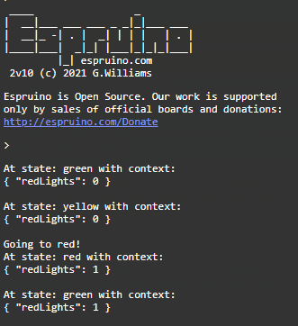

# Example of a basic xstate-fsm machine

The example code shows the xtate-fsm function createMachine in use to create a simple three state machine.
and then the use of the Interpreter service to initialise the machine and send the machine three 'TIMER' events
to demonstrate the machine changing states upon the event.

The machine cycles through three states: green, yellow and red.
at each state it uses xstate-fsm defined Actions to turn an appropriate coloured LED ON upon entering the state 
and OFF when exiting the state.
The action functions utilise the Espruino digitalwrite  function to activate the leds.
see <https://www.espruino.com/Reference#t_l__global_digitalWrite> 


In this example all the action functions are contained in line within the machine state definitions.  eg
```javascript
green: {
        entry: [ () => digitalWrite(greenLed,on)],
        exit: [ () => digitalWrite(greenLed,off)],
      on: {
        TIMER: 'yellow'
      }
    },
```
The above code defines the state 'green' with an action function defined  on entry to the state and on exit from the state.  The definition specifies  on the event 'TIMER' the machine will change to the 'yellow' state.

Note Actions are defined in an array, where the array brackets are optional if only one action is defined.

See further examples for using named actions defined in the options section of the machine definition.

The example demonstrates the use of 'context' in xstate-fsm. The context holds quantitive data which further defines any finite state of the machine. 
(see <https://xstate.js.org/docs/guides/context.html#context>)

The intiial context is defined in the context property of the machine definition:

````javascript
const lightMachine = createMachine({
  id: 'light',
  initial: 'green',
  context: { redLights: 0 },
  states: {
````
in this case the context object property 'redlights' is defined and initialised as zero. 

the 'assign' action is then used to update the machines context in the entry action of the red state.

````javascript
red: {
        entry: [
          assign({ redLights: (ctx) => ctx.redLights + 1 }),
          () => digitalWrite(redLed,on)
        ],

````
see <https://xstate.js.org/docs/guides/context.html#assign-action>

And so the context is counting the number of times the machine has entered the red state.


After defining the machine, the definition is passed to the xstate-fsm interpret service and defined, in this case, as the const 'lightService' :

```javascript
// setup the machine interpreter
const lightService = interpret(lightMachine);

lightService.subscribe((state) => {
  console.log('At state: ' + state.value + ' with context:');
  console.log(state.context);
  console.log(' ');
});
```
The subscribe method of the service defines a function to be executed at each state change of the machine.  It is passed the object 'state' which includes the property 'context'.

The following code then initialises the machine within the interpreter and sends the machine the TIMER event three times.

```javascript
lightService.start();
lightService.send('TIMER');
lightService.send('TIMER');
lightService.send('TIMER');
```

This results in the machine executing three state transitions, turning on and off the leds on the microcontroller and with a console output that looks like this.


