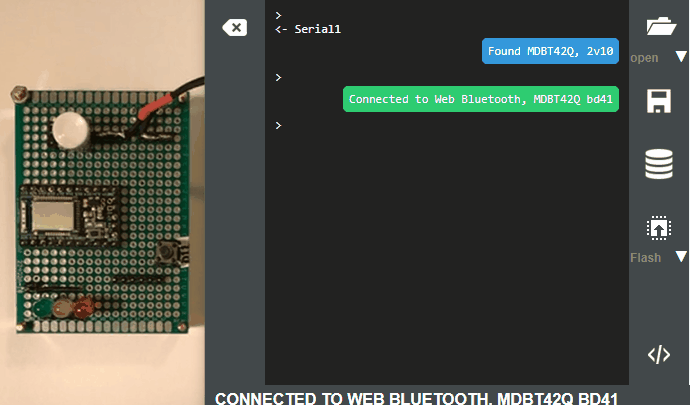

# Example using an input button to generate an event

This example builds on the basic lightMachine example by showing how an input push button switch can be used to generate an event which is sent to the state machine.

The following code is the difference in this exanmple which achieves this.

```javascript
// Send a BUTTON event on the raising edge of a button press 
setWatch( 'lightService.send("BUTTON")',buttonPin,{repeat:true, edge:1});
```

The setwatch() function is provided in the Espruino API for the purpose of monitoring a digital input on the microcontroller and executing a function (or the contents of a string as it is here) when the digital signal changes state.

The parameters of the setwatch() function are documented here
<https://www.espruino.com/Reference#t_l__global_setWatch>

In this case the function is passed the ID of the digital input pin to watch (the const buttonPin) and passed an options object that specifies to continually monitor (repeat) and to trigger the event on the rising edge of the signal change. 

In the example,  the string that is executed on the input change is **'lightService.send("BUTTON")'**. send() is XState/fsm interpreter service function which sends a specified event to the interpreted machine. In this case the change triggers the sending of a BUTTON event, named as a string.  Note BUTTON is the arbitrary name of the event defined in the state machine configuration to trigger the state changes, that is the event could just as easily be named KEYPRESS within the machine config.

## Demo



## References

* XState/fsm service.send:  <https://xstate.js.org/docs/packages/xstate-fsm/#service-send-event>
* Working with buttons in Espruino: <https://www.espruino.com/Button>